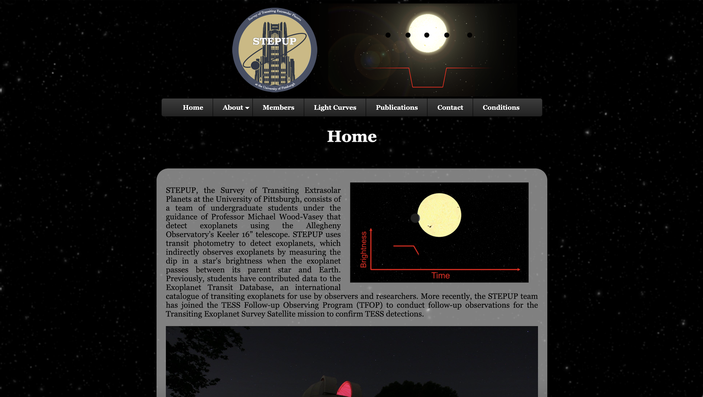
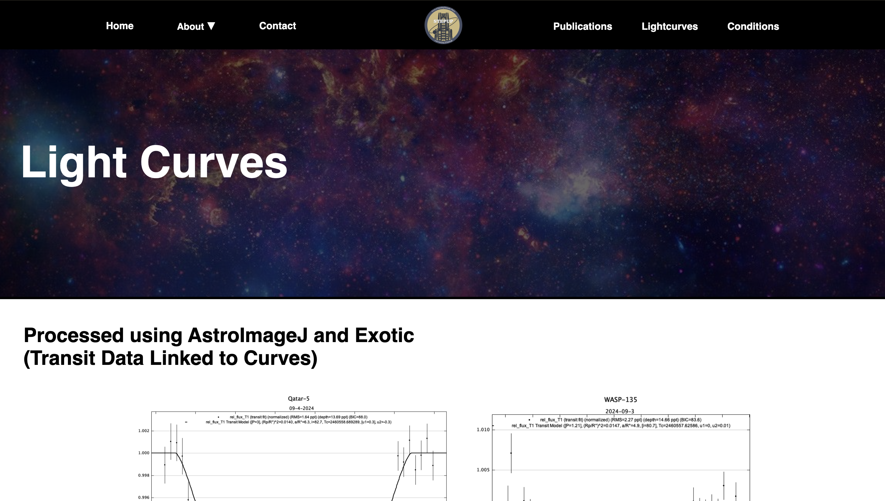

# STEPUP Website Update
- Updates to the University of Pittsburgh's STEPUP research group website.
- Styling this site in a similar manner to NASA's main website.
- Access the website at: https://sites.pitt.edu/~stepup/index.html
- Will likely move over to a more responsive React site, though this is not a current priority of the group.
- Currently providing a quick modernization and clean up, as well as a responsive navbar.
##  Prior to Updates:

## Post Updates:

##  Prior to Updates:

## Post Updates:

##  Prior to Updates:

## Post Updates:

##  Prior to Updates:

## Post Updates:

##  Prior to Updates:

## Post Updates:

